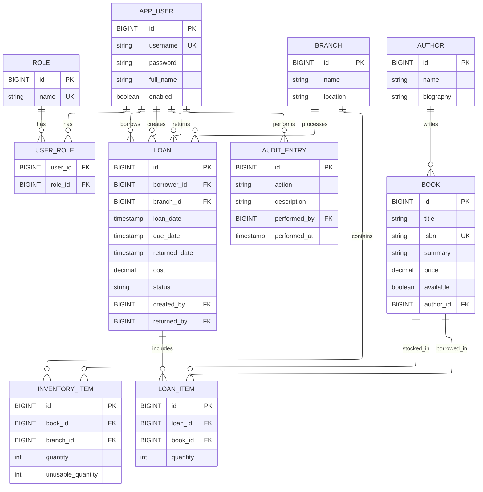

# ER Diagram

```mermaid
---
config:
  layout: elk
---
erDiagram
    ROLE ||--o{ USER_ROLE : has
    APP_USER ||--o{ USER_ROLE : has
    APP_USER ||--o{ LOAN : borrows
    APP_USER ||--o{ LOAN : creates
    APP_USER ||--o{ LOAN : returns
    APP_USER ||--o{ AUDIT_ENTRY : performs
    BRANCH ||--o{ INVENTORY_ITEM : contains
    BRANCH ||--o{ LOAN : processes
    AUTHOR ||--o{ BOOK : writes
    BOOK ||--o{ INVENTORY_ITEM : stocked_in
    BOOK ||--o{ LOAN_ITEM : borrowed_in
    LOAN ||--o{ LOAN_ITEM : includes
    ROLE {
        BIGINT id PK
        string name UK
    }
    APP_USER {
        BIGINT id PK
        string username UK
        string password
        string full_name
        boolean enabled
    }
    USER_ROLE {
        BIGINT user_id FK
        BIGINT role_id FK
    }
    BRANCH {
        BIGINT id PK
        string name
        string location
    }
    AUTHOR {
        BIGINT id PK
        string name
        string biography
    }
    BOOK {
        BIGINT id PK
        string title
        string isbn UK
        string summary
        decimal price
        boolean available
        BIGINT author_id FK
    }
    INVENTORY_ITEM {
        BIGINT id PK
        BIGINT book_id FK
        BIGINT branch_id FK
        int quantity
        int unusable_quantity
    }
    LOAN {
        BIGINT id PK
        BIGINT borrower_id FK
        BIGINT branch_id FK
        timestamp loan_date
        timestamp due_date
        timestamp returned_date
        decimal cost
        string status
        BIGINT created_by FK
        BIGINT returned_by FK
    }
    LOAN_ITEM {
        BIGINT id PK
        BIGINT loan_id FK
        BIGINT book_id FK
        int quantity
    }
    AUDIT_ENTRY {
        BIGINT id PK
        string action
        string description
        BIGINT performed_by FK
        timestamp performed_at
    }
```
